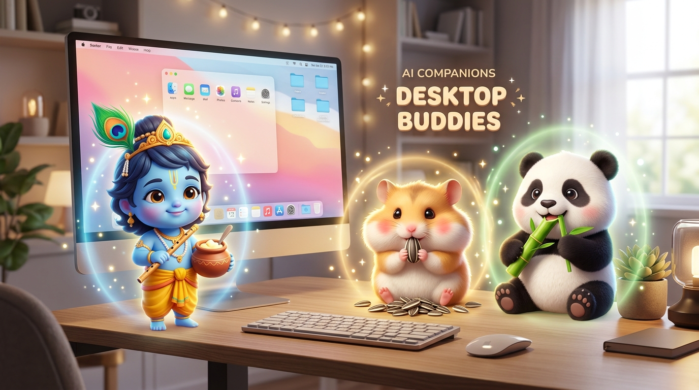
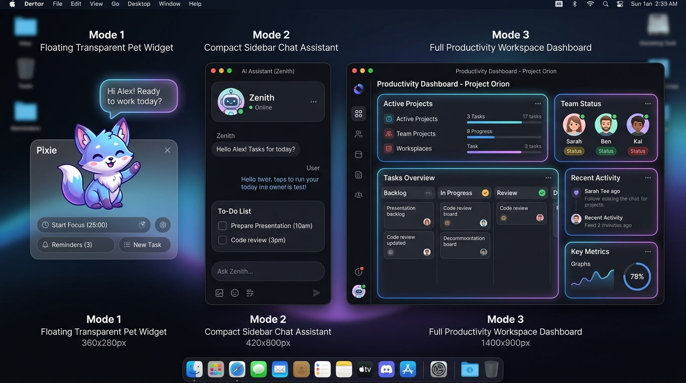

# 🐾 Desktop Buddy (`my-desktop-buddy`)

<div align="center">



<h3>✨ Your Adorable AI Desktop Companions & Productivity Pets ✨</h3>

<p>
  <strong>Hammy the Hamster</strong> 🐹 &bull; <strong>Bambu the Panda</strong> 🐼 &bull; <strong>Little Krishna</strong> 🪶
</p>

[](https://nextjs.org/)
[](https://fastapi.tiangolo.com/)
[](https://www.electronjs.org/)
[](https://opensource.org/licenses/MIT)

</div>

---

## 🌟 What is Desktop Buddy?

**Desktop Buddy** is a delightful, open-source AI desktop companion that floats on your screen as a responsive animated character. Whether you need a focus partner, an encouraging voice, an AI assistant to answer questions, or simply an adorable buddy munching snacks by your side while you work, Desktop Buddy is here for you!

---

## 🎭 Character Guide

Your companion's personality, favorite snacks, and interactive reactions change based on who you choose.

### The Buddies

| Buddy | Character | Snack | Personality & Vibe | Special Features |
| :--- | :--- | :--- | :--- | :--- |
| 🐹 **Hammy** | Golden Hamster | 🌻 Sunflower Seeds | Energetic, cheerful, celebratory, and always ready to cheer you on! | Wiggle animations, seed munching, victory cheers |
| 🐼 **Bambu** | Kawaii Panda | 🎋 Fresh Bamboo | Calm, peaceful, zen, mindful, and loves cozy focus sessions. | Bamboo crunching, zen meditation vibes |
| 🪶 **Little Krishna** | Divine Companion | 🧈 Sweet Butter (Makhan) | Playful, loving, wise, and radiates uplifting cosmic joy & warmth. | Sweet bansuri flute music 🪈, dynamic poses & mudras, peacock feather crown |

### 🪶 Spotlight: Little Krishna — The Enchanting Companion

<div align="center">
  
  <br/>
  <em>"Work with joy in your heart and let your creativity dance like a sweet flute melody!"</em>
</div>

- **🪈 Flute Melodies**: Tap to listen to soothing bansuri flute melodies right on your desktop.
- **🧈 Makhan Feeding**: Double-click to feed freshly churned sweet butter with joyful eating reactions!
- **🧘 Multi-Pose State Engine**: Switch smoothly between dynamic poses: `Idle` &bull; `Protector` &bull; `Thinking` &bull; `Happy` &bull; `Motivation` &bull; `Relax` &bull; `Greeting` &bull; `Clicked`
- **🎨 6 Sacred Color Palettes**: Customize his look with *Shyam Sundar Blue*, *Peacock Teal*, *Golden Glow*, *Warm Amber*, *Midnight Navy*, or *Emerald Forest*.

---

## 📖 User Guide

### 👆 Interacting with Your Buddy
- **Single Click**: Pet your buddy to trigger happiness hearts, cheerful greetings, and positive affirmations.
- **Double Click**: Feed your buddy their favorite snack (e.g. Makhan 🧈, Sunflower Seeds 🌻) and watch them happily eat!
- **Click & Drag**: Click on the widget's drag handle to move your buddy anywhere across your desktop.
- **Tap to Talk 🎙️**: Click the microphone icon to speak naturally to your buddy. They will transcribe your speech and reply with a synthesized voice.

### 🪟 Window Modes
Desktop Buddy adapts to your workflow with 3 layout modes:

<div align="center">
  
</div>

1. **🐾 Pet** — a minimal, transparent overlay that floats on your desktop with quick actions and speech bubbles.
2. **💬 Sidebar** — a narrow side panel with the AI chat, your To-Do list and settings.
3. **🖥️ Dashboard** — the full productivity workspace, with room for chat history and tasks side by side.

**Switching modes.** Every mode carries the same three-way switcher, so you can
get to any mode from any other:

| Action | How |
| :--- | :--- |
| Switch mode | Click 🐾 / 💬 / 🖥️ in the mode switcher |
| Keyboard | `Cmd/Ctrl + 1` Pet · `Cmd/Ctrl + 2` Sidebar · `Cmd/Ctrl + 3` Dashboard |
| Step back a mode | `Esc` (Dashboard → Sidebar → Pet) |
| From the menu bar | Tray / dock icon → **View mode** |

Your chosen mode is remembered, so the app reopens where you left it. Your chat
history, focus timer and tasks all carry across modes — switching never resets them.

**Window controls** mean the same thing in every mode:

| Control | What it does |
| :--- | :--- |
| 📌 / 📍 | Pin or unpin the window above other apps (Pet & Sidebar) |
| `−` | Minimize to the dock — click the menu-bar icon to bring it back |
| `✕` | Hide the window; everything keeps running |
| `⤢` | Maximize / restore (Dashboard only) |
| ⏻ | Quit the app and stop the local backend — always asks first |

### ✅ Productivity & Tasks
- Open the To-Do list from the widget toolbar.
- Add tasks you want to accomplish today.
- Your buddy will actually **know what's on your To-Do list**! If you ask, *"What should I do next?"*, they will read your tasks and encourage you to complete them.

---

## 🚀 Installation Guide

### Prerequisites
- **[Node.js](https://nodejs.org/)** (v18 or newer)
- **[Python](https://www.python.org/)** (v3.10 or newer)
- **Git**

### Option A: Quick Setup via Scripts (Recommended)

**For macOS / Linux (Terminal):**
```bash
# 1. Clone the repository
git clone https://github.com/swapnilxi/my-desktop-buddy.git
git clone https://github.com/swapnilxi/my-desktop-buddy.git
cd my-desktop-buddy

# 1. First-Time Setup (Installs all dependencies)
./start_mac.sh

# 2. Starting the App (After setup is done)
./startup_mac.sh
```

**For Windows (Command Prompt / PowerShell):**
```cmd
git clone https://github.com/swapnilxi/my-desktop-buddy.git
cd my-desktop-buddy

:: 1. First-Time Setup (Installs all dependencies)
start_windows.bat

:: 2. Starting the App (After setup is done)
startup_windows.bat
```

### Option B: Manual Startup

If the startup script doesn't work for you, you can run the backend and frontend separately:

**1. Start the FastAPI Backend:**
```bash
cd backend
python -m venv venv
source venv/bin/activate  # Or `venv\Scripts\activate` on Windows
pip install -r requirements.txt
uvicorn main:app --reload --port 8000
```

**2. Start the Next.js Frontend:**
```bash
cd frontend
npm install
npm run dev
```

### Accessing the App
Once running:
- **Web Interface**: Open [http://localhost:3000](http://localhost:3000)
- **API Documentation**: Open [http://localhost:8000/docs](http://localhost:8000/docs)

---

## ⚙️ Configuration Guide

Desktop Buddy is highly customizable. Open the **⚙️ Config Tab** in the app to access these settings.

### 1. Connecting an AI Model
You need an LLM API key for your buddy to talk to you. The app supports Gemini, DeepSeek, and local Ollama.

**To get a FREE Google Gemini Key:**
1. Go to [Google AI Studio](https://aistudio.google.com/).
2. Click **"Get API Key"** and create a free key.
3. In Desktop Buddy, paste your key into the **Gemini API Key** field.
4. Click **💾 Save Configuration**.

*Want privacy?* You can use **Ollama** to run models locally on your machine for zero-latency, 100% private interactions.

### 2. Customizing Your Buddy
In the Config Tab, you can:
- **Select your Character**: Switch between Hamster, Panda, or Little Krishna.
- **Rename your Buddy**: Give them a unique name (e.g., *Nibbles*, *Pan-Pan*).
- **Change the Color Theme**: Pick from beautifully curated color palettes for each character.
- **Select UI Theme**: Toggle Dark/Light mode or System Preference.

### 3. Server-Side Configuration (Optional)
If you don't want to paste keys into the browser, you can provide them at the server level:
1. Copy `.env.example` to `.env` in the root folder.
2. Add your keys to the `.env` file (e.g., `GEMINI_API_KEY=your_key_here`).
3. Restart the backend.

### 🔒 Security Note
Keys entered in the web UI are stored **locally in your browser's LocalStorage** and passed per request. They are **never stored on the server**. You can use the **"🗑️ Clear Keys"** button at any time to wipe credentials.

---

## 📁 Modular Project Structure

```
my-desktop-buddy/
├── public/                       # Media Assets & Generated Images
│   └── assets/                   
├── frontend/                     # Next.js 15 Web & Desktop Interface
│   └── src/
│       ├── app/                  # Main page, multi-mode layout
│       ├── components/
│       │   ├── Buddies/          # 🐾 Multi-Buddy Engine (Hamster, Panda, Krishna)
│       │   ├── Chat/             # AI chat conversation panel
│       │   ├── TodoList/         # Productivity tasks & checklists
│       │   └── Config/           # Settings & API keys configuration
│       └── lib/                  # LocalStorage API manager & TTS speech engine
├── backend/                      # FastAPI Python Backend
│   ├── main.py                   # App lifecycle, routing
│   ├── context.py                # Buddy persona & Todo-list injection
│   ├── routes/                   # Chat, Todos, Voice endpoints
│   └── llm/                      # Multi-provider routers (Gemini, DeepSeek, Ollama)
├── electron-desktop/             # Optional native desktop wrapper
├── start_mac.sh                  # 1-click installer (Mac/Linux)
├── startup_mac.sh                # 1-click launcher (Mac/Linux)
├── start_windows.bat             # 1-click installer (Windows)
├── startup_windows.bat           # 1-click launcher (Windows)
└── .env.example                  # Server-level environment template
```

---

## 🛠️ Adding a New Buddy (For Developers)

Creating a new character is clean and modular:

1. Create a folder in `frontend/src/components/Buddies/<YourBuddyName>/`.
2. Add your sprite component (`<YourBuddyName>Sprite.tsx`) implementing `BuddySpriteProps`.
3. Add your styles and animations (`<yourbuddy>.css` or `.module.css`).
4. Register your character in `frontend/src/components/Buddies/registry.ts`.
5. Add the persona template in `frontend/src/components/Buddies/<YourBuddyName>/<yourbuddy>_prompt.txt` or `backend/context.py`.

---

## 📄 License

Distributed under the **MIT License**. Free for personal and educational use.

<div align="center">
  <sub>Built with 💖 for developers, creators, and cute desktop pet lovers everywhere.</sub>
</div>
